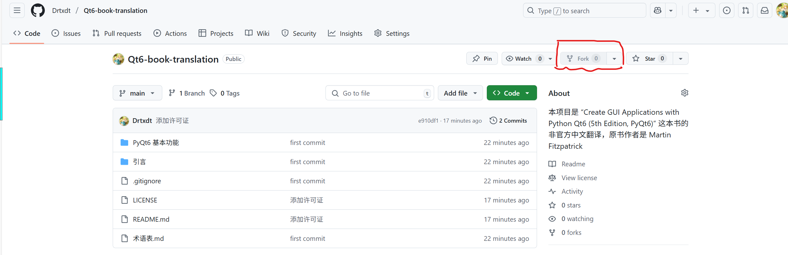

# 贡献指南

首先，十分感谢您愿意为本项目做出贡献！以下的内容请您务必知晓

**请您务必了解许可证 [Apache 2.0](LICENSE) 的内容并承诺遵守许可证条款**

## Bug修复

我们可以会出现某些Bug。您在提交时请务必列出Bug类型、复现过程以及您的解决方案

## 标准协作流程

以下是Github的标准协作流程。如果您是大佬，您可以忽略以下内容

### Fork（复刻）本仓库

在本仓库的右上角，您可以找到Fork按钮。



您只需此按钮单击右侧的三角打开下拉菜单，点击 `Create a new Fork`，您就成功将它fork到您的账户下了

### 配置本地环境

请在本地的任意位置打开终端

```bash
# 克隆您的Fork仓库
# 替换为你的GitHub用户名
git clone https://github.com/<你的用户名>/Qt6-book-translation.git
cd Qt6-book-translation

# 添加上游仓库(关联原项目)
git remote add upstream https://github.com/Drtxdt/Qt6-book-translation.git

# 同步最新代码(避免过期)
git fetch upstream
git checkout main  # 切换到主分支
git merge upstream/main  # 合并上游更新
git push origin main  # 推送到你的Fork

# 创建新的分支
# 推荐格式 <种类>/<简略描述>
git checkout -b <type>/<description>
```

对于 `commit` ，我们最好遵守这样的格式，注意是半角（英文）的冒号：

```text
<种类>: <具体内容>
```

有关种类，可以参考以下：

- **feat**: 新功能（feature）
- **fix**: 修复 bug
- **docs**: 文档变更
- **style**: 代码风格变动（不影响代码逻辑）
- **refactor**: 代码重构（既不是新增功能也不是修复bug的代码更改）
- **perf**: 各种优化
- **test**: 添加或修改测试
- **chore**: 杂项（构建过程或辅助工具的变动）
- **build**: 构建系统或外部依赖项的变更
- **ci**: 持续集成配置的变更
- **revert**: 回滚

### 开始您的工作

您可以按照您的想法随意编辑文件。请定期进行提交：

```bash
git add <your file>
git commit -m "........"
```

您也可以准备完整提交：

```bash
# 完整检查后提交所有修改
git add --update  # 添加所有修改文件
git commit -m "............."
```

### 将分支推送到您的Fork

```bash
git push -u origin <type>/<description>
```

### 创建Pull Request（PR，拉取请求）

请您登录Github并选择您的分支，然后单击按钮 `Create Pull Request`。请你按照上文的约定编写PR描述。我会定期查看，并且回复您的PR